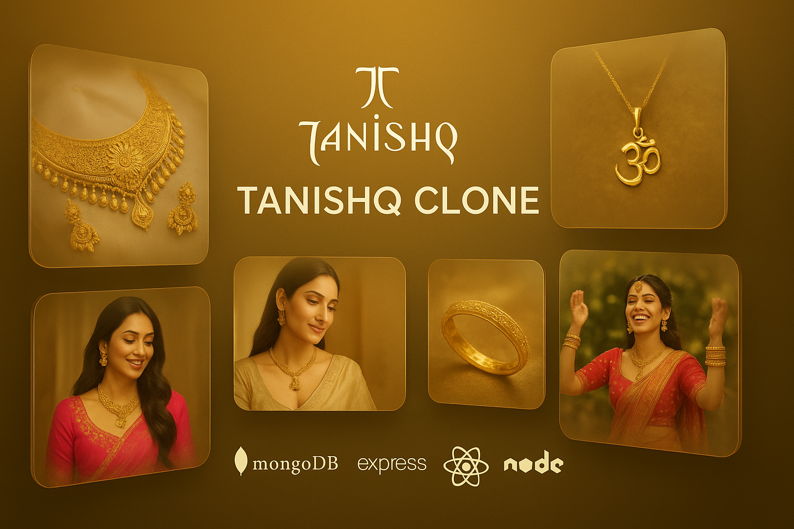
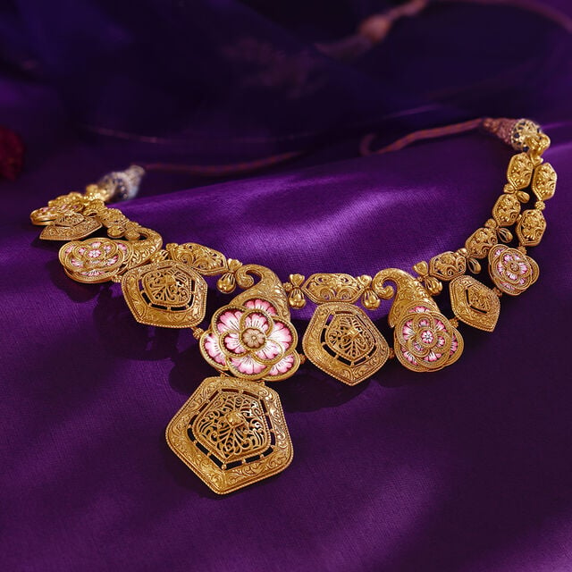

# 💍 Tanishq Clone - Premium Jewellery E-commerce Platform



A sophisticated, full-stack MERN e-commerce application inspired by **Tanishq**. This project delivers a premium shopping experience for luxury jewelry, featuring a high-performance customer storefront, a robust administrative dashboard, and a secure, scalable backend API.

---

## 🏗️ Project Architecture

The project is structured as a monorepo containing three core modules:

- **`client/`**: The modern React-based storefront for customers.
- **`admin/`**: A comprehensive management dashboard for store administrators.
- **`server/`**: A powerful Node.js/Express API with MongoDB integration.

---

## 🌟 Core Features

### 🛒 Customer Storefront (Client)

- **Elegant UI**: Modern, responsive design built with Tailwind CSS.
- **Dynamic Catalog**: Real-time gold rates and automated product pricing.
- **Interactive Shopping**: Advanced filters, category browsing, and seamless search.
- **Checkout & Payments**: Integrated **Razorpay** for secure transactions.
- **User Engagement**: Wishlist management, product reviews, and order tracking.
- **Notifications**: Instant feedback via `react-toastify`.

### 🛡️ Admin Dashboard

- **Inventory Control**: Full CRUD operations for products, categories, and collections.
- **Order Tracking**: Real-time management of customer orders and payment statuses.
- **Analytics & Settings**: Manage banners, gold rates, and global store configurations.
- **Role Management**: Secure access control for store personnel.

### ⚙️ Backend API (Server)

- **Robust Auth**: OTP-based registration, JWT session management, and password recovery.
- **Automation**: CRON jobs for updating gold prices and automated tasks.
- **Media Cloud**: **Cloudinary** integration for high-quality image storage.
- **Data Security**: Secure middlewares, rate-limiting, and sanitized inputs.

---

## 🛠️ Technology Stack

| Layer            | Technologies                                               |
| :--------------- | :--------------------------------------------------------- |
| **Frontend**     | React 18, Vite, Redux Toolkit, React Query, Tailwind CSS 4 |
| **Backend**      | Node.js, Express.js (v5), JavaScript (ESM)                 |
| **Database**     | MongoDB with Mongoose ODM                                  |
| **Payment Gate** | Razorpay                                                   |
| **Storage**      | Cloudinary                                                 |
| **Email/SMS**    | Brevo, Nodemailer                                          |
| **Icons & UI**   | Lucide React, Swiper             |

---

## 📂 Project Structure

```text
Tanishq-Clone/
├── admin/               # Administrative Dashboard (React + Vite)
│   └── [Detailed README](./admin/README.md)
├── client/              # Customer Front-end (React + Vite)
│   └── [Detailed README](./client/README.md)
├── server/              # Backend API (Node + Express)
│   └── [Detailed README](./server/README.md)
└── images/              # Shared Assets & Media
```

---

## ⚡ Getting Started

### 📥 Prerequisites

- **Node.js** (>= 18)
- **MongoDB** (Local or Atlas)
- **External Accounts**: Cloudinary, Razorpay, Brevo (for full functionality)

### 🚀 Installation & Setup

1. **Clone the repository**

   ```bash
   git clone https://github.com/rajkishort596/Tanishq-clone.git
   cd Tanishq-clone
   ```

2. **Setup Server**

   ```bash
   cd server
   npm install
   # Create .env and add: MONGODB_URI, JWT_SECRET, RAZORPAY_KEY, etc.
   npm run dev
   ```

3. **Setup Admin Panel**

   ```bash
   cd ../admin
   npm install
   # Create .env with VITE_API_URL
   npm run dev
   ```

4. **Setup Client**
   ```bash
   cd ../client
   npm install
   # Create .env with VITE_API_URL
   npm run dev
   ```

---

## 📸 Product Showcases

<p align="center">
  
  
  
</p>

---

## 🤝 Contributing

Contributions are welcome! Please feel free to submit a Pull Request.

---

## 👤 Author

**Rajkishor Thakur**  
[LinkedIn](https://www.linkedin.com/in/rajkishor-thakur/)  |  [Portfolio](https://rajkishort-portfolio.vercel.app)

---

> [!NOTE]  
> This project is a clone for educational and demonstration purposes. All brand assets belong to Tanishq (Titan Company Limited).
